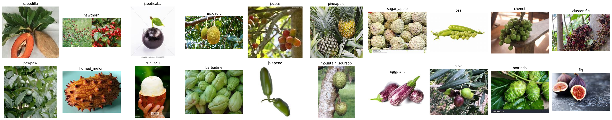
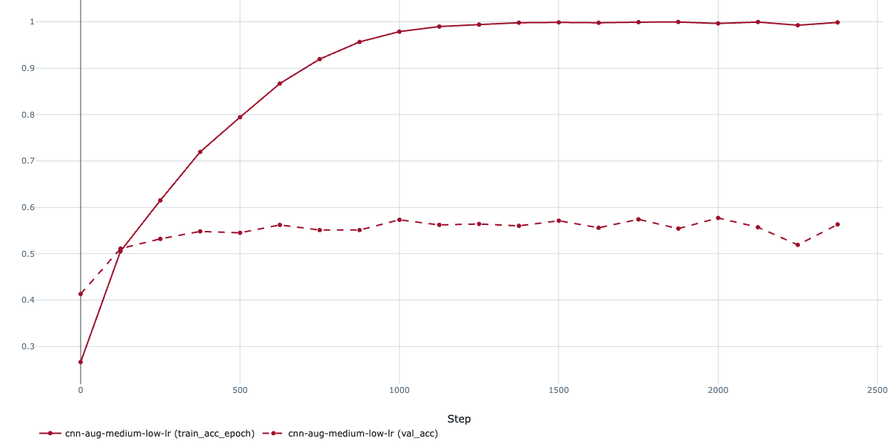
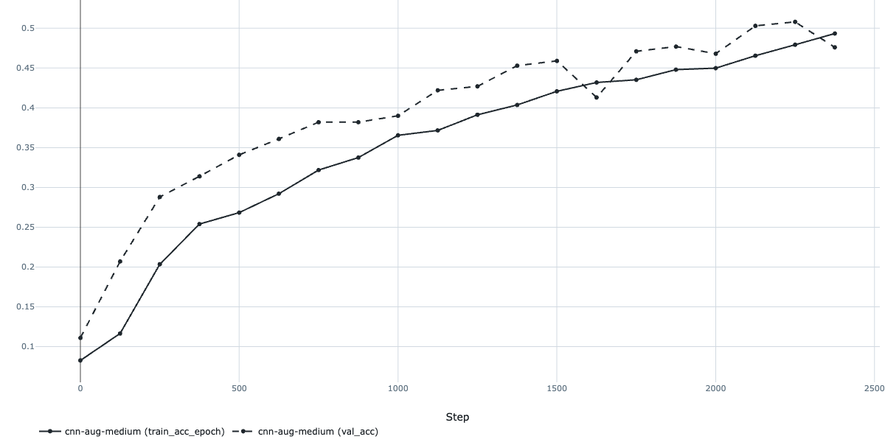
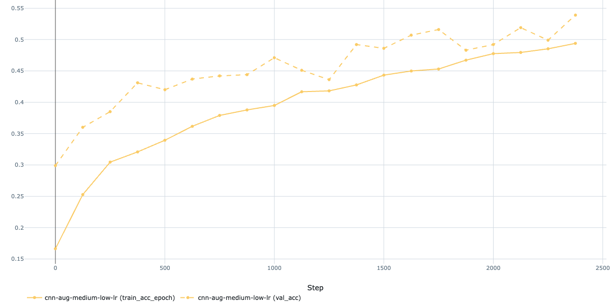
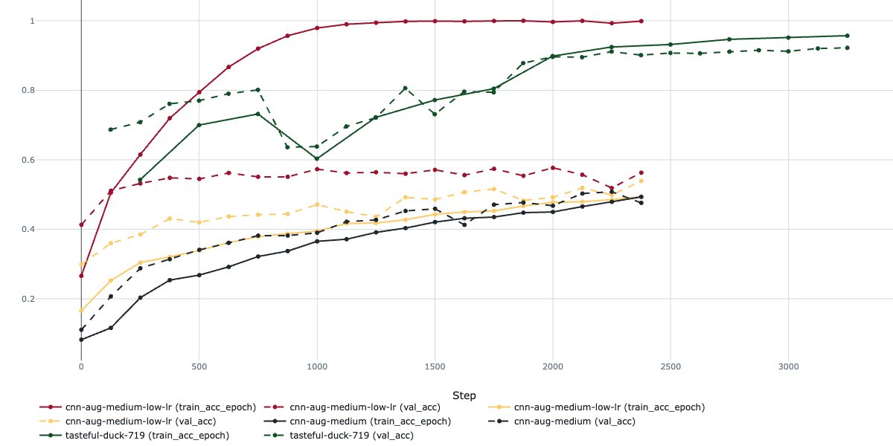
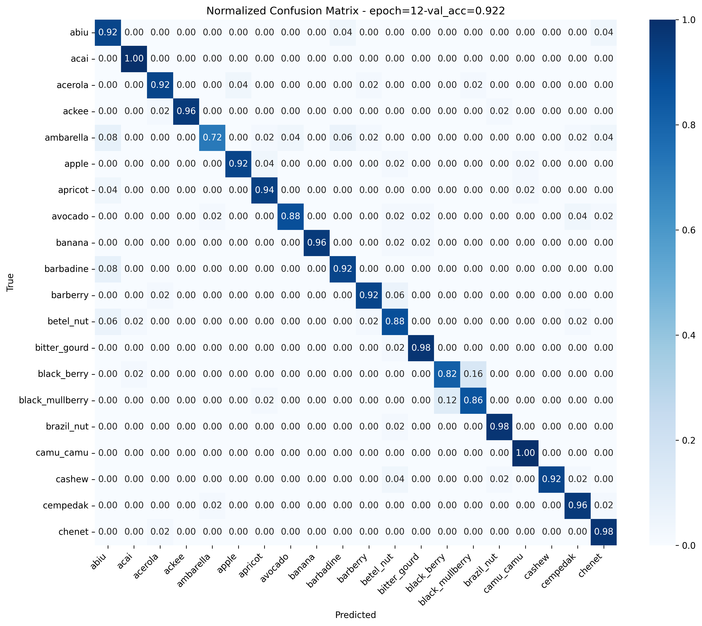
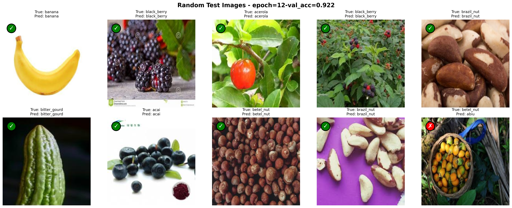

# Fruit Classification Kaggle Challenge

To sharpen my computer vision skills, I tackled a Kaggle challenge centered on classifying 100 different fruits. The dataset is nicely balanced, with each fruit class offering ~400 images for training, 50 for validation, and 50 for testing. I will only focus on classifying the first 20 fruit classes though to keep the training times managable. 

Here's some example images:

## Methodology

### Exploratory Data Analysis (EDA)

Before diving into machine learning, I wanted to understand the data to make informed choices about my approach. My **Exploratory Data Analysis** (EDA) lives in the `notebooks/eda.ipynb` Jupyter notebook, have a look!.

The dataset is decently large, and the samples per class are quite varied. This suggests augmentation might not be needed right away, but I’ll revisit that idea later if the model starts overfitting.

### Baseline

With a good grasp of the data, I started with a simple architecture and no augmentation to establish a baseline. Loss curves would help me figure out where to improve.

Spoiler alert: the initial model overfit extremely quickly...

I introduced basic augmentations like random flips, slight rotations, and color tweaks. The model didn't overfit anymore, but the results actually decreased a bit and the accuracy stalled at around 50%. Not horrible, but not exactly in the range of what we're looking for.

Next, I tried lowering the learning rate to nudge things along:

This helped a bit, but the model was still underperforming. Time to heed the "bitter lesson" of machine learning: scale up the model and compute! I switched to a ResNet50 pretrained on ImageNet and upgraded my training pipeline with early stopping, learning rate monitoring, and gradual unfreezing, all powered by the excellent PyTorch Lightning framework (which plays nicely with MLflow, by the way).

The pretrained ResNet50 immediately improved things, with high accuracy from the start since I initially trained only the final fully connected layer. When progress plateaued, I gradually unfroze the network while lowering the learning rate to balance training new parameters without forgetting the pretrained weights.

After tuning hyperparameters and running a few experiments, I achieved a validation accuracy of ~93%. Pretty sweet for a first pass, though there’s room to grow with more time.

To ensure no sneaky issues, I tested on the test set and scored a respectable 92%. Solid results, no monkey business! You can see the resulting confusion matrix below:

Finally here's a few random examples and the predictions of the model:

